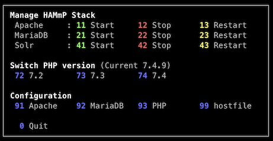

# Management

The HAMmP repository comes with a bash menu to manage the different service of
the HAMmP setup.

The script is located at `/Volumes/webdev/www/_apache/bin/hammp`. The 
`/Volumes/webdev/www/_apache/bin` directory is added to the bash `$PATH`
variable (see [Apache installation](./Apache.md)).

We can open the CLI menu from anywhere in the terminal:

```bash
hammp
```

The menu contains items to control the services, switch active PHP version, to
open the service config files and to edit the hosts file.



---

* [Overview](../README.md)
