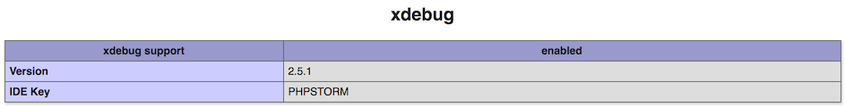
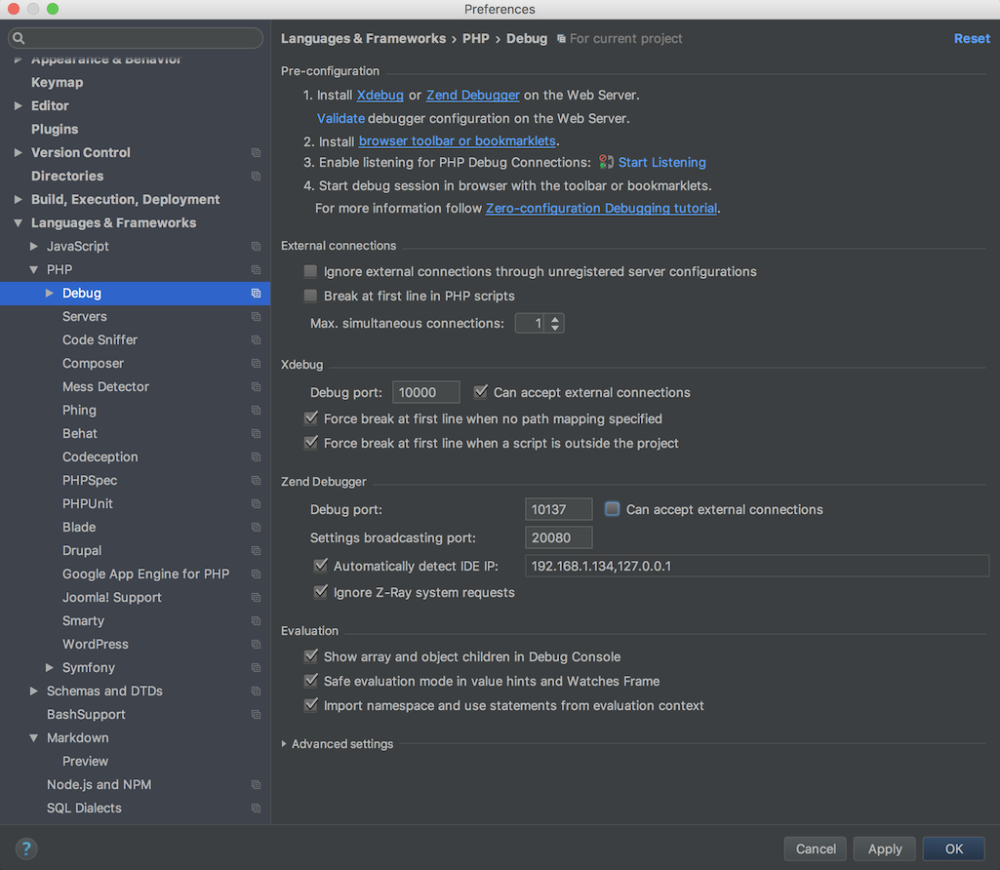
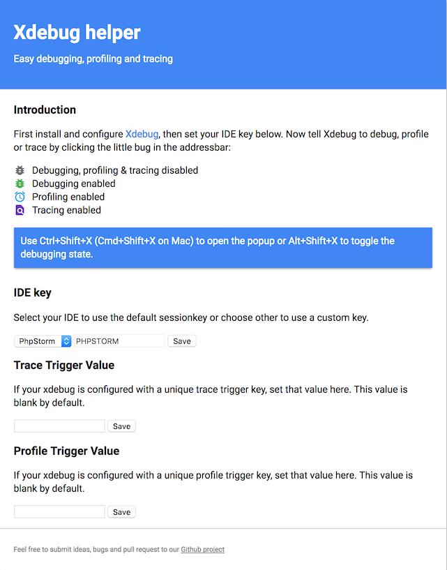

# Xdebug

Xdebug is an extension for PHP to assist with debugging and development. It
contains a single step debugger to use with IDEs; it upgrades PHP's var_dump()
function; it adds stack traces for Notices, Warnings, Errors and Exceptions; it
features functionality for recording every function call and variable assignment
to disk; it contains a profiler; and it provides code coverage functionality for
use with PHPUnit.

More info see the [Xdebug website](https://xdebug.org/).

## Install Xdebug

```bash
sphp 7.3 && pecl install xdebug
sphp 7.4 && pecl install xdebug
sphp 8.0 && pecl install xdebug
```

##	Configure Xdebug

Xdebug is by default not setup to allow debugging. We need to add it to the 
configuration:

> **Note**: This configuration is for **Xdebug 3.x**!

```bash
cat >> $(brew --prefix)/etc/php/[php-version]/conf.d/ext-xdebug.ini <<EOF

xdebug.mode=coverage,debug,develop
xdebug.client_port=10000
xdebug.client_host="localhost"
xdebug.idekey=PHPSTORM
xdebug.file_link_format="phpstorm://open?file=%f&line=%l"
xdebug.remote_handler="dbgp"

EOF
```

Instead of [php-version] use one of the: 7.3, 7.4, 8.0 depending on your
installed versions.

> Note : we change the default port 9000 to 10000 since 9000 is already in use
> by PHP-FPM.

## Restart PHP-FPM

Restart the PHP-FPM service so it loads the changed configuration.

```bash
sphp 8.0
```

## Test

You should also check [http://localhost/phpinfo.php](http://localhost/phpinfo.php) 
to ensure that Xdebug information is displayed.



## Configure PhpStorm

PhpStorm is by default configured to listen on port 9000. That port is already 
in use by PHP-FPM. We configured Xdebug to use port 10000. 

We need to update PhpStorm configuration for this:

* PhpStorm > Preferences
* Languages & Frameworks > PHP > Debug

Change the Xdebug configuration:

* Debug Port : 10000
* Can accept external connections : enable



> *Note* : This needs to be configured for each project separately (it's not a 
> global PhpStorm setting).


## Debug in command line (cli)

Sometimes you want to debug php scripts in PHPStorm while running in command 
line (drush, Symfony command, ...).

You can enable & disable debugging using bash aliases.

###	Add CLI aliases

Add 2 aliases: one to enable and one to disable PHP debugging for Bash Scripts
using Xdebug and PhpStorm:

_Multiline command, copy all at once:_

```bash
cat >> ~/.bash_profile <<EOF

# PHP CLI XDEBUG -------------------------------------
alias phpdebug-on="export XDEBUG_CONFIG='idekey=PHPSTORM'"
alias phpdebug-off="unset XDEBUG_CONFIG"

EOF
```

Resource bash profile file to be able to use it immediately without restarting 
terminal.

```bash
source ~/.bash_profile
```

### Usage

Enable the remote debugger listener in PHPStorm.

Open a terminal screen and run:

```bash
phpdebug-on
```

Run the PHP script in the CLI, PHPStorm debug window will open.

###	Stop debugging

Close the CLI window or run:

```bash
phpdebug-off
```

> *Note* : You need to start the debugging for each new terminal window, the 
> debug status is kept per terminal session.

## Install Chrome extension

Install the
[xdebug-helper](https://chrome.google.com/webstore/detail/xdebug-helper/eadndfjplgieldjbigjakmdgkmoaaaoc)
Chrome extension to start/stop debugging sessions from within the browser.

Configure the extension so it uses the proper IDE:

* Right click the browser icon and click on the Options item
* Or open chrome-extension://eadndfjplgieldjbigjakmdgkmoaaaoc/options.html
* Set the IDE key to `PHPSTORM`



## Xdebug output toggler

There is an optional chrome extension
"[xDebug output toggler](https://chrome.google.com/webstore/detail/xdebug-output-toggler/ekjpdpmelhdapkilemcamlpcocekgbed?hl=en-GB)"
to toggle show/hide xDebug output in the browser. 

This can be handy to temporary hide this information (or errors) from the
screen.


## Extensions for other browsers

* [See extensions for other browsers](https://confluence.jetbrains.com/display/PhpStorm/Browser+Debugging+Extensions).

---

* [Next : Composer](PHP-Composer.md)
* [Overview](../README.md)
