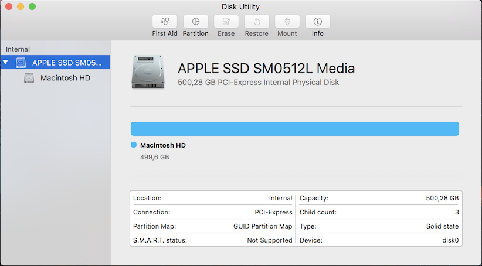
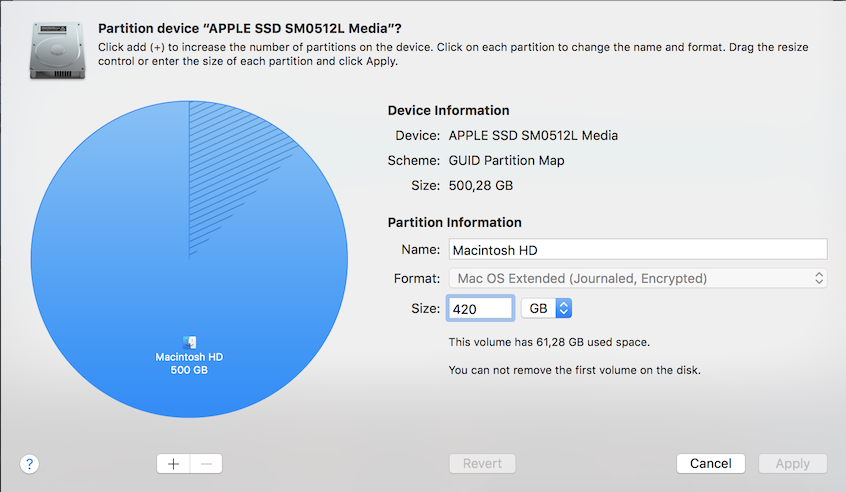
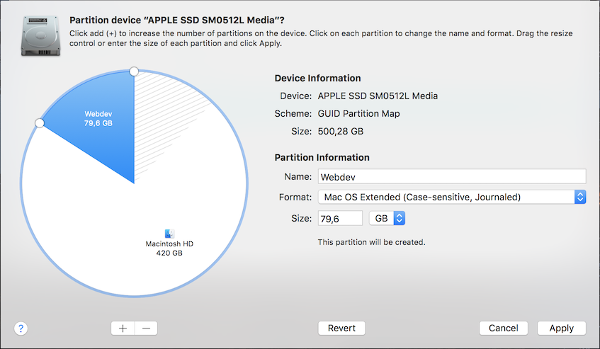
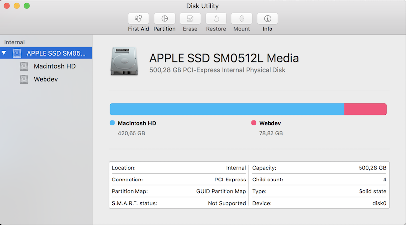

# Preparation

## Create case sensitive partition
AMP stacks are mostly hosted on Linux servers. Linux has a case sensitive 
file system, the default OS X/macOS filesystem is not case sensitive.

To have an environment that is a close to projects live servers, we create a 
separate case sensitive partition.

> **Note** : This step is optional.

* Open the Disk Utility (Applications > Utilities > Disk Utility)
  
* Select the Main harddisk, Open the Partition tab.
* Resize the "Macintosh HD" partition until you have enough space for web 
  development.
  
* Create a new partition with the free disk space, give it the name "webdev", 
  select "Mac OS Extended (case-sensitive, Journaled)" as the file system.
  
* Click on Apply to apply the changes. The Macintosh HD partition will be 
  resized and the new partition will be added.
  

We will use that partition for storing the Apache's vhosts.


## Install Xcode Command line tools
We need command line tools to compile and install custom PHP plugins.

We need to have Xcode Command line toolsinstalled to have the necessary tools. 

Run the following command to only install the Xcode essentials including the 
Command line tools:

```bash
$ xcode-select --install
```

> **Note** : Installing Xcode essentials is done trough the Software Updates
> interface (App store).


---
* [Next : Homebrew](./Homebrew.md)
* [Overview](../README.md)
