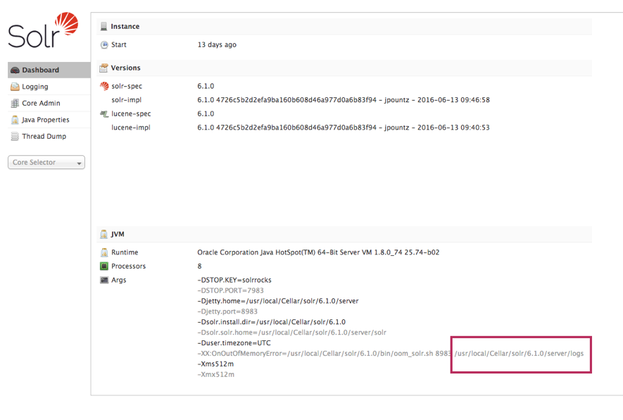

# Apache Solr on a specific version

> [!NOTE]
> Solr 10.0 is recently released, Drupal does not support 10 yet. This describes
> how to install and pin a 9.x version through Homebrew.

## Install Apache Solr

Remove Solr 10 (if already installed)

```shell
brew unlink solr
brew uninstall solr
```

Set up a local tap (one-time setup):

```shell
brew tap-new homebrew/local
```

Extract Solr 9.x into your local tap . This reaches back into Homebrew's git
history and copies the formula for the version you want:

```shell
brew extract --version=9.10.1 solr homebrew/local
```

If 9.10.1 isn't found, try 9.10.0 or 9.9.0 — use whatever is the latest 9.x
available in the history. You can check what's been committed via 
`brew log solr`.

Install the extracted formula

```shell
brew install homebrew/local/solr@9.10.1
```

Pin it so brew upgrade never bumps it to v10

```shell
brew pin homebrew/local/solr@9.10.1
```

To verify the pin:

```shell
brew list --pinned
```

Link it

```shell
brew link --overwrite homebrew/local/solr@9.10.1
```

To start/stop Solr as a service:

```shell
$(brew --prefix)/opt/solr@9.10.1/bin/solr start
$(brew --prefix)/opt/solr@9.10.1/bin/solr stop
```

You can access he Web GUI by browsing to
[http://localhost:8983](http://localhost:8983).

## Add aliases

Remembering the full start/stop commands can be tricky, let's add some aliases
for them:

Edit `~/.zshrc` and add following alias:

```bash
alias solr="$(brew --prefix)/opt/solr@9.10.1/bin/solr"
```

Now we can start/stop the solr service with:

```shell
solr start
solr stop
```

## Create a new core

> Note : Solr must be running to create a core trough command line. This because
> it uses the web API for it.

Creating a new core in Solr is very simple:

```bash
solr create -c CORE_NAME
```
   
The new core will be created in `$(brew --prefix)/opt/solr/server/solr/CORE_NAME`.
   
This is also the directory where the config files are located.

### Log files location

Open the Solr admin interface dashboard to see log location: 
[http://localhost:8983/solr/#/](http://localhost:8983/solr/#/).



### Add solr core for Drupal

See [Apache Solr Add Core](../HowTo/Apache-Solr-Add-Core.md).

## Clearing all data within a core

All indexed data within a singe core can be cleared by running the solr-clear
command:

```bash
solr-clear CORE_NAME
```

This is a custom script and is located within the [bin directory](../../bin).

## SOLR_MODULES

When you get following message in Drupal:

> ""lib" directives in solrconfig.xml are deprecated and will be removed in
> Solr 10.0. Ensure to load the required modules in your Solr 9.8 or higher 
> server. One way is to set the SOLR_MODULES environment variable to include 
> the modules required by Search API Solr per default: 
> SOLR_MODULES="extraction,langid,ltr,analysis-extras".

Edit Solr's environment config file:

```shell
vi $(brew --prefix)/Cellar/solr@9.10.1/9.10.1/share/solr@9.10.1/solr.in.sh
```

Uncomment the line containing SOLR_MODULES and change it to:

```text
SOLR_MODULES="extraction,langid,ltr,analysis-extras"
```

Restart solr:

```shell
solr restart
```

---

* [Overview](../README.md)
