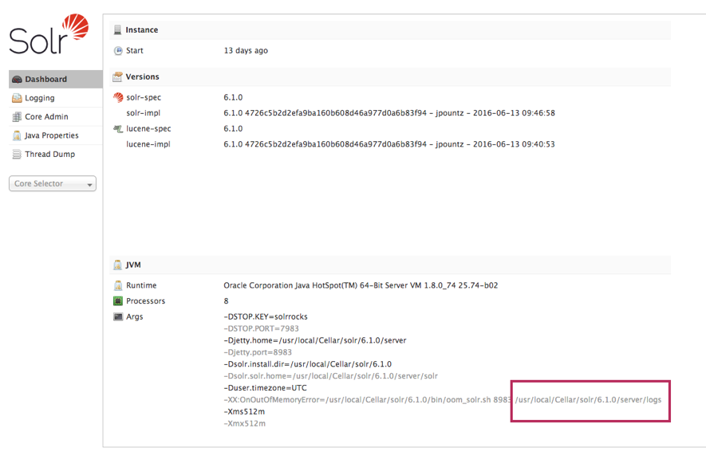

# Apache Solr

## Install Apache Solr

Install Solr with homebrew:

> Note : Solr requires Java, [install java trough homebrew](./Java.md) if not
yet installed.

```bash
brew instal solr
```

You need to start/stop Solr by default manually:

```bash
solr start
solr stop
```

Or you can run following command to make Solr auto start on boot:

```bash
brew services start solr
```

You can access he Web GUI by browsing to 
[http://localhost:8983](http://localhost:8983).

## Create a new core

> Note : Solr must be running to create a core trough command line. This because
> it uses the web API for it.

Creating a new core in Solr is very simple:

```bash
solr create -c CORE_NAME
```
   
The new core will be created in `/usr/local/opt/solr/server/solr/CORE_NAME`.
   
This is also the directory where the config files are located.

### Log files location

Open the Solr admin interface dashboard to see log location: 
[http://localhost:8983/solr/#/](http://localhost:8983/solr/#/).



### Add solr core for Drupal

See [Apache Solr Add Core](../HowTo/Apache-Solr-Add-Core.md).

---

* [Overview](../README.md)
